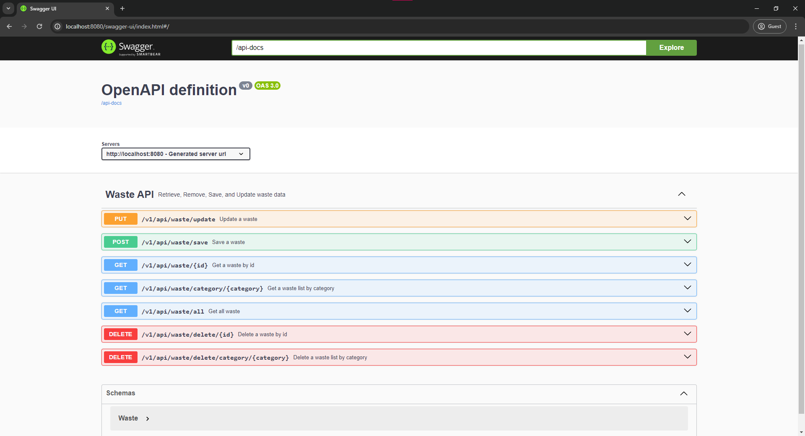

## Overview

This is a RESTful API developed for Waste Management, a leading environmental consulting firm. The API facilitates waste
data processing for clients, enabling them to add, update, delete and retrieve waste data through simple API requests,
and save the data in the database.

## Technology Stack

- Java (17+)
- Spring Boot
- Maven
- H2 Database (In-memory)
- JUnit 5
- Mockito
- Swagger
- Lombok

## Setup and Installation

1. Ensure you have Java 17 and Maven installed on your machine.
2. Clone the repository to your local machine.
3. Navigate to the project directory and run the command `mvn clean install` to build the project.
4. Run the command `mvn spring-boot:run` to start the application.

## API Endpoints

The API consists of several endpoints to facilitate waste data management. Detailed documentation for each endpoint,
including request and response formats, will be provided in the subsequent sections.

### Get a waste by id

- Method: GET
- Path: `/v1/api/waste/{id}`
- Parameters: `id` (path parameter)
- Response: A `Waste` object

### Get list of wastes by category

- Method: GET
- Path: `/v1/api/waste/category/{category}`
- Parameters: `category` (path parameter)
- Response: A list of `Waste` object

### Get all wastes

- Method: GET
- Path: `/v1/api/waste`
- Response: A list of `Waste` objects

### Add a waste

- Method: POST
- Path: `/v1/api/waste`
- Parameters: `waste` (request body)
- Response: A `Waste` object

### Update a waste

- Method: PUT
- Path: `/v1/api/waste`
- Parameters: `waste` (request body)
- Response: A `Waste` object

### Delete a waste by id

- Method: DELETE
- Path: `/v1/api/waste/{id}`
- Parameters: `id` (path parameter)
- Response: A string message indicating the deletion status

### Delete a list waste by category

- Method: DELETE
- Path: /v1/api/waste/category/{category}
- Parameters: category (path parameter)
- Response: A string message indicating the deletion status

## Error Handling

The application has a global exception handler that handles all exceptions thrown by the application. It returns a
response with an appropriate HTTP status code and a message describing the error.

- `WasteNotFoundException`: This exception is thrown when there is an error finding a waste. It returns a 404 Not Found
  status code.

## Database

The application uses an in-memory H2 database for storing data. The data in the database is temporary and will be lost
when the application is stopped.

  ##NOTE
  Issue with database: The database continues to be case sensitive despite clear configuration and URL disabling it, ensure that when requesting Categories the category name is in PascelCase e.g. "GeneralWaste" instead of "generalwaste"

## Testing

Unit tests have been written to ensure the functionality, reliability, and performance of the API endpoints. To run the
tests, navigate to the project directory and run the command `mvn test`.

### Test Coverage

The tests cover a variety of scenarios, including:

- Adding a waste
- Updating a waste
- Deleting a waste
- Deleting wastes by category
- Retrieving a waste by its ID
- Retrieving a wastes by Category
- Retrieving all wastes

##NOTE

Add/Update Waste Request:
When using postman to test the API, please ensure that the waste data is sent as a JSON object in the request body. The
header should be set to `Content-Type: application/json`.

Get waste by id/Delete waste by id:
When using postman to test the API, please ensure that the waste id is passed as a path parameter in the URL. When using
postman ensure that the Headers are set to `Content-Type: application/json`

Get all wastes:
When using postman ensure that the Headers are set to `Content-Type: application/json`
